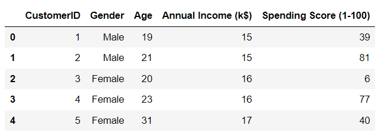
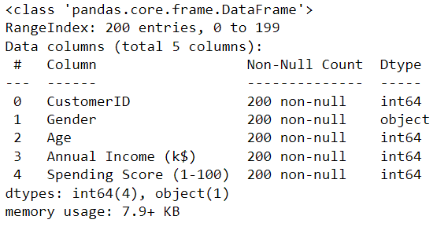
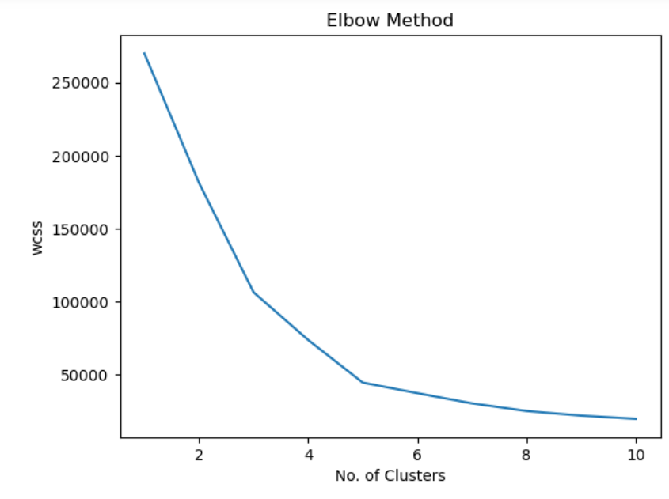
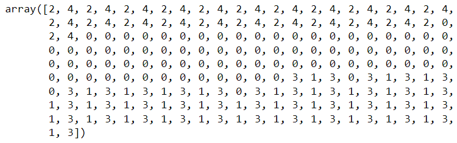
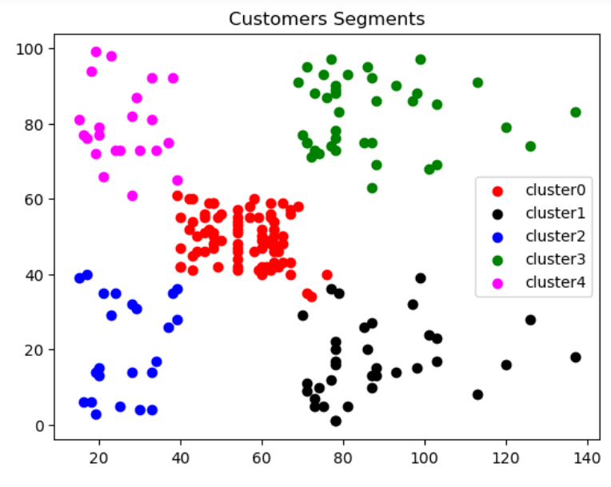

# Implementation-of-K-Means-Clustering-for-Customer-Segmentation

## AIM:
To write a program to implement the K Means Clustering for Customer Segmentation.

## Equipments Required:
1. Hardware – PCs
2. Anaconda – Python 3.7 Installation / Jupyter notebook

## Algorithm
1. Data Loading and Exploration:

*  You’ve loaded the dataset from a CSV file named “Mall_Customers.csv” using pandas.

* You’ve printed the first five rows of the dataset using data.head().

* You’ve also displayed information about the dataset using data.info().

2. K-means Clustering:

* You’ve calculated the Within-Cluster Sum of Squares (WCSS) for different numbers of clusters (from 1 to 10) using the Elbow Method.

* The Elbow Method helps determine the optimal number of clusters by observing the “elbow” point in the plot where the WCSS starts to decrease at a slower rate.

* You’ve initialized a KMeans model with 5 clusters using the “k-means++” initialization method.

* You’ve fit the model to the features (Annual Income and Spending Score) using kmeans.fit(data.iloc[:,3:]).

* The kmeans.inertia_ attribute gives the WCSS for the current number of clusters.

3. Predictions and Visualization:

* You’ve predicted the cluster labels for each data point using km.predict(data.iloc[:,3:]).

* You’ve added a new column called “cluster” to the dataset with the predicted cluster labels.

* You’ve separated the data into different dataframes based on the predicted clusters (e.g., df0, df1, etc.).

* Finally, you’ve created a scatter plot to visualize the clusters, where each cluster is represented by a different color.


## Program:
```
Program to implement the K Means Clustering for Customer Segmentation.
Developed by: Anish Raj P
RegisterNumber:  212222230010
```
```py
import pandas as pd                      
import matplotlib.pyplot as plt          
data = pd.read_csv("CSVs/Mall_Customers.csv")
data.head()
data.info() 
data.isnull().sum()
from sklearn.cluster import KMeans
wcss = [] #Within-Cluster Sum of Square.
#It is the sum of squared distance between each point & the centroid in a cluster. 
for i in range(1,11):
    kmeans = KMeans(n_clusters = i,init = "k-means++")
    kmeans.fit(data.iloc[:,3:])
    wcss.append(kmeans.inertia_) 
plt.plot(range(1,11),wcss)
plt.xlabel("No. of Clusters")
plt.ylabel("wcss")
plt.title("Elbow Method")
km = KMeans(n_clusters = 5)
km.fit(data.iloc[:,3:]) 
y_pred = km.predict(data.iloc[:,3:])
y_pred
data["cluster"] = y_pred
df0 = data[data["cluster"]==0]
df1 = data[data["cluster"]==1]
df2 = data[data["cluster"]==2]
df3 = data[data["cluster"]==3]
df4 = data[data["cluster"]==4]
plt.scatter(df0["Annual Income (k$)"],df0["Spending Score (1-100)"],c="red",label="cluster0")
plt.scatter(df1["Annual Income (k$)"],df1["Spending Score (1-100)"],c="black",label="clusterl")
plt.scatter(df2["Annual Income (k$)"],df2["Spending Score (1-100)"],c="blue",label="cluster2")
plt.scatter(df3["Annual Income (k$)"],df3["Spending Score (1-100)"],c="green",label="cluster3")
plt.scatter(df4["Annual Income (k$)"],df4["Spending Score (1-100)"],c="magenta",label="cluster4")
plt.legend()
plt.title("Customer Segments")
```

## Output:
### df.head():

### df.info():

### Elbow Method Graph:

### K-Means Cluster:

### Customer Segments Graph:


## Result:
Thus the program to implement the K Means Clustering for Customer Segmentation is written and verified using python programming.
